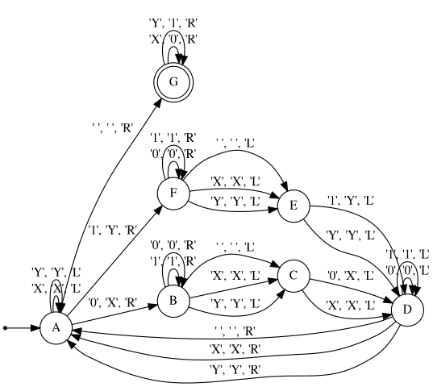

# Alan

[](https://goreportcard.com/report/github.com/kelvindecosta/alan)
[](https://godoc.org/github.com/kelvindecosta/alan)

A programming language for *designing* Turing machines.


## Installation

Download the [latest release](https://github.com/kelvindecosta/alan/releases/latest) or build it from source.

```bash
go get -u github.com/kelvindecosta/alan
```

## Walkthrough

This section describes a workflow.

For an in-depth guide navigate to the [Wiki](https://github.com/kelvindecosta/alan/wiki).
Here are some useful links:

*   [Definition](https://github.com/kelvindecosta/alan/wiki/Definition)
*   [Syntax](https://github.com/kelvindecosta/alan/wiki/Syntax)
*   [Interface](https://github.com/kelvindecosta/alan/wiki/Interface)

Consider the following example, the definition for a Turing machine that accepts all binary strings that are palindromic:

```
# This is a definition of a Turing Machine that accepts binary strings that are palindromes
' '
A*
    'X' 'X' < A
    'Y' 'Y' < A
    '0' 'X' > B
    '1' 'Y' > F
    ' ' ' ' > G
B                   # Starting with 0
    '0' '0' > B
    '1' '1' > B
    ' ' ' ' < C
    'X' 'X' < C
    'Y' 'Y' < C
F                   # Starting with 1
    '0' '0' > F
    '1' '1' > F
    ' ' ' ' < E
    'X' 'X' < E
    'Y' 'Y' < E
C
    '0' 'X' < D
    'X' 'X' < D
E
    '1' 'Y' < D
    'Y' 'Y' < D
D
    '0' '0' < D
    '1' '1' < D
    ' ' ' ' > A
    'X' 'X' > A
    'Y' 'Y' > A
G.
    'X' '0' > G
    'Y' '1' > G
```

Graph the machine:

```bash
alan graph _examples/binary-palindrome.aln | dot -Tpng -o _assets/readme/binary-palindrome.png
```

<p align="center"></p>

Run the machine on some inputs:

*   ```bash
    alan run _examples/binary-palindrome.aln -i 101
    ```

    ```
    Accepted
    ```
*   ```bash
    alan run _examples/binary-palindrome.aln -i 1010
    ```

    ```
    Rejected
    ```

## Citation

If you use this implementation in your work, please cite the following:

```
@misc{decosta2019alan,
    author = {Kelvin DeCosta},
    title = {Alan},
    year = {2019},
    howpublished = {\url{https://github.com/kelvindecosta/alan}},
}
```
