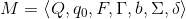
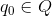
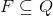
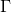
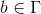
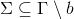
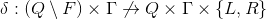
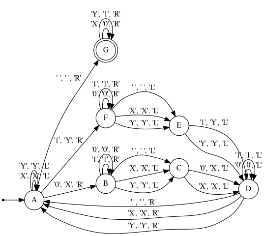

# Alan

[](https://goreportcard.com/report/github.com/kelvindecosta/alan)

A programming language for *designing* Turing Machines.

## Installation

Download the [latest release](https://github.com/kelvindecosta/alan/releases/latest) or build it from source.

```bash
go get -u github.com/kelvindecosta/alan
```

## Definition

Alan constructs Turing Machines based on the following formal definition:

*   
    >   A Turing **Machine**.
*   
    >   A *finite*, *non-empty* set of **states**.
*   
    >   The starting state
*   
    >   The set of **final** or **accepting** states.
    >
    >   The machine is said to *accept* an input tape if it halts in one of these states.
*   
    >   A *finite* *non-empty* set of **tape symbols**.
*   
    >   A *symbol* which occurs **infinitely often** at any step during computation.
*   
    >   The set of **input symbols** which are allowed to appear in the *initial* tape contents.
*   
    >   A *partial function* describing the **transitions** in the Turing Machine.
    >
    >   Whenever the machine is in a *particular state* and encounters a *particular character* in the tape, it is associated with a **unique ordered triplet** of a *state*, *symbol* and *direction*.


## Syntax

Refer to [this example](./examples/binary-palindrome.aln) as you learn the simple syntax.

### Comments

Alan supports *single line* comments with `#`.

```
# This is a definition of a Turing Machine that accepts binary strings that are palindromes
```

### Symbol

The *first parsed line* of a definition must be the *blank character* surrounded by *single quotes*.

```
' '
```

> The program throws an error if multiple symbols are set as the blank symbol.
>
> The program infers the rest of the symbols from the transitions.

### State

A state is a *valid identifier*.

*   States that are followed by a `*` are set as the start state.

    ```
    A*
    ```

    > Only one state can be set as the start state.

*   States that are followed by a `.` are set as an end state.

    ```
    G.
    ```

    >   Note that the state `S` can be set as *both* the start state and an end state in the following ways:
    >    *   `S.*`
    >    *   `S*.`

### Transition

Syntactically, transitions *immediately follow* a state.

```
A*
    'X' 'X' < A
    'Y' 'Y' < A
    '0' 'X' > B
    '1' 'Y' > F
    ' ' ' ' > G
```

They are defined as : `'currentSymbol' 'nextSymbol' direction 'nextState'`.

> Note that the `directions` `<` & `>` correspond to left & right moves along the tape.

> Note that the tape head points to `currentSymbol` which is changed to `nextSymbol` prior to moving.

## Usage

Summon Alan using the command `alan`.

```
A programming language for designing Turing Machines

Usage:
  alan [command]

Available Commands:
  graph       Graph a Turing Machine
  help        Help about any command
  run         Run a Turing Machine

Flags:
  -h, --help   help for alan

Use "alan [command] --help" for more information about a command.
```

### `run`

This subcommand loads a Turing Machine from a file and **performs computation** on an *input string*.

```
Run a Turing Machine

Usage:
  alan run file [flags]

Flags:
  -h, --help             help for run
  -i, --input string     input string
  -m, --max-steps uint   maximum steps before forced halt (default 200)
```

#### Example

*   ```bash
    alan run examples/binary-palindrome.aln -i 101
    ```

    ```
    Halted   : true
    Accepted : true
    ```

*   ```bash
    alan run examples/binary-palindrome.aln -i 1010
    ```

    ```
    Halted   : true
    Accepted : false
    ```

### `graph`

This subcommand loads a Turing machine from a file and outputs the definition for the same in [DOT](https://www.graphviz.org/doc/info/lang.html), a language that ships with [Graphviz](https://www.graphviz.org/)

```
Graph a Turing Machine

Usage:
  alan graph file [flags]

Flags:
  -h, --help   help for graph
```

#### Example

*   ```bash
    alan graph examples/binary-palindrome.aln
    ```

    ```
    digraph machine {
        rankdir=LR;
        size="8,5";

        node [shape = point]; 0;
        node [shape = doublecircle]; G;
        node [shape = circle];
        0 -> A;
        B -> B [ label = "'0', '0', 'R'" ];
        B -> B [ label = "'1', '1', 'R'" ];
        B -> C [ label = "' ', ' ', 'L'" ];
        B -> C [ label = "'X', 'X', 'L'" ];
        B -> C [ label = "'Y', 'Y', 'L'" ];
        F -> F [ label = "'0', '0', 'R'" ];
        F -> F [ label = "'1', '1', 'R'" ];
        F -> E [ label = "' ', ' ', 'L'" ];
        F -> E [ label = "'X', 'X', 'L'" ];
        F -> E [ label = "'Y', 'Y', 'L'" ];
        G -> G [ label = "'X', '0', 'R'" ];
        G -> G [ label = "'Y', '1', 'R'" ];
        C -> D [ label = "'0', 'X', 'L'" ];
        C -> D [ label = "'X', 'X', 'L'" ];
        E -> D [ label = "'1', 'Y', 'L'" ];
        E -> D [ label = "'Y', 'Y', 'L'" ];
        D -> D [ label = "'0', '0', 'L'" ];
        D -> D [ label = "'1', '1', 'L'" ];
        D -> A [ label = "' ', ' ', 'R'" ];
        D -> A [ label = "'X', 'X', 'R'" ];
        D -> A [ label = "'Y', 'Y', 'R'" ];
        A -> G [ label = "' ', ' ', 'R'" ];
        A -> A [ label = "'X', 'X', 'L'" ];
        A -> A [ label = "'Y', 'Y', 'L'" ];
        A -> B [ label = "'0', 'X', 'R'" ];
        A -> F [ label = "'1', 'Y', 'R'" ];
    }
    ```

*   With `dot` command and some *piping*, Alan can create a **visualization** of the Turing Machine defined in a file.

    ```bash
    alan graph examples/binary-palindrome.aln | dot -Tpng -o assets/binary-palindrome.png
    ```

    <p align="center"></p>
