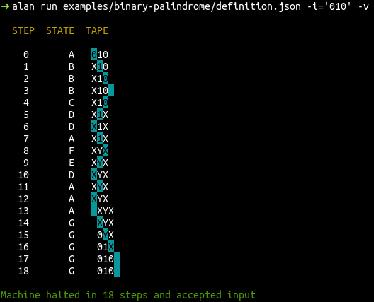
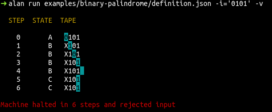

# Alan

A Turing Machine simulator

## Installation

Download the [latest release](https://github.com/kelvindecosta/alan/releases/latest) or build it from source

```bash
go get -u github.com/kelvindecosta/alan
```

## Commands

### `run`

With the `run` command, a definition is loaded onto a machine which computes on the set of inputs

Each line from a file is taken as an input

```
alan run -h
Run machine on input(s)

Usage:
  alan run machine [flags]

Flags:
  -f, --file string      path to input file
  -h, --help             help for run
  -i, --input string     direct input
  -s, --max-steps uint   maximum steps until halt (default 200)
  -v, --verbose          verbose output
```

### `design`

The `design` command helps create and edit Turing machine definitions

```
alan design -h
Design definition of machine

Usage:
  alan design machine [flags]

Flags:
      --add-trans strings    set of transitions to be added   : <q1><s1><s2><q2><L/R> separated by ,
  -A, --alphabet string      alphabet of input
  -B, --blank string         blank tape symbol
  -D, --description string   description of machine
  -F, --final string         set of final states
  -h, --help                 help for design
      --no-final-state       whether set of final states is empty
      --rem-trans strings    set of transitions to be removed : <q1><s1><s2><q2><L/R> separated by ,
  -S, --start string         start state of machine
  -Q, --states string        states of machine
  -L, --symbols string       symbols of tape
```

## Usage

A defintion for a Turing machine which accepts all binary palindromes is constructed with the following commands

```bash
alan design examples/binary-palindrome.json -A='01' -L='01XY ' -B=' '                       # define alphabet, sybols and blank
alan design examples/binary-palindrome.json -D='Checks if binary string is a palindrome'    # set description
alan design examples/binary-palindrome.json -Q='ABCDEFG' -S='A' -F='G'                      # define all, start and final states
alan design examples/binary-palindrome.json --add-trans="AXXAL,AYYAL,A0XBR,A1YFR,A  GR"     # define transitions from state 'A'
alan design examples/binary-palindrome.json --add-trans="B11BR,B00BR,B  CL,BXXCL,BYYCL"     # define transitions from state 'B'
alan design examples/binary-palindrome.json --add-trans="F11FR,F00FR,F  EL,FXXEL,FYYEL"     # define transitions from state 'F'
alan design examples/binary-palindrome.json --add-trans="C0XDL,CXXDL,E1YDL,EYYDL"           # define transitions from states 'C' & 'E'
alan design examples/binary-palindrome.json --add-trans="D11DL,D00DL,D  AR,DXXAR,DYYAR"     # define transitions from state 'D'
alan design examples/binary-palindrome.json --add-trans="GX0GR,GY1GR"                       # define transitions from state 'G'
```

The following commands show the machine in action

```bash
alan run examples/binary-palindrome.json -i='010' -v
```



```bash
alan run examples/binary-palindrome.json -i='0101' -v
```

